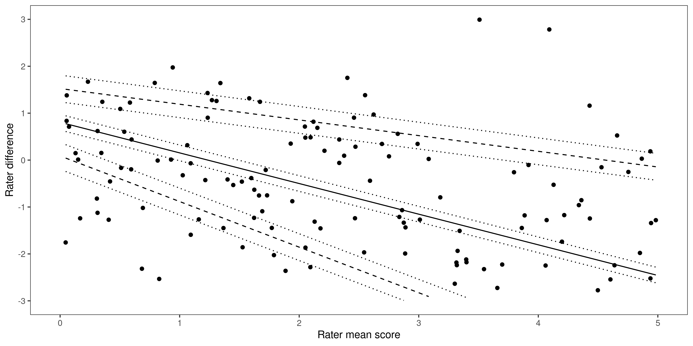
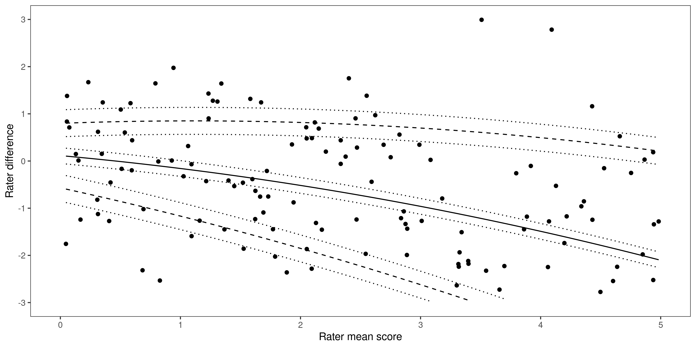

# Bland-Altman plots (with proportional bias)

Bland-Altman plots (1983) and their associated analyses can be used to graphically represent and explore the nature and level of agreement on scale ratings made by two judges. We propose this methodology as a useful supplement to traditional reliability analyses used in social sciences such as psychology, especially in cases where data is skewed or truncated and analysts wish to look at rater agreement in isolation. 

This repository contains code used to generate Bland-Altman plots when proportional bias is present (i.e. when linear regression indicates there is a non-constant association between rater differences and rater mean score). In such cases, limits of agreement (LoA) and 95% confidence intervals (CIs) should not be calculated in the traditional manner (Ludbrook, 2010). Instead, hyperbolic LoA and CIs should be calculated using the approximate method supplied by Carkeet (2015) as demonstrated below. 

## Dependencies

This code has been tested using R version 3.6.3. This code depends on the following packages:
```
ggplot2 3.3.3
blandr 0.5.1
dplyr 1.0.4
gridExtra 2.3
ggpubr 0.4.0
```

## Analysis

The code used to produce the plots in the accompanying paper is:
```
make_plots_for_paper.R
```
This script uses a private csv file containing the data. To reuse this code for a different analysis, make the relevant adjustments to this script to use your own data.

The main functions used by this script are stored in the `R` folder.

## Example

To demonstrate the methodology we have provided a simple example using synthetic data. We create a data set of "read" value and then create two instruments to simulate observations. Both instruments apply some random variation to the real value, with a mean of zero and variance of 0.1, using the `rnorm` function. Instrument 1 adds some additional random values with a bias, by adding a random number from a uniform distribution between 0 and a value proportional to the value being measured.  Therefore, the bias gets larger for larger values of the value.

In the images below we show this data displayed on two Bland-Altman plots, one with a linear fit (upper) and one with a quadratic fit (lower). The values of the best fit parameters will be different for each run since the data is generated at random.




To repeat this exercise simple run through the script
```
example.R
```
which will produce some additional plots as you step through each line to demonstrate the method.

## References

Altman, D. G., & Bland, J. M. (1983). Measurement in medicine: The analysis of method comparison studies. Journal of the Royal Statistical Society, 32(3), 307-317. https://doi.org/10.2307/2987937

Carkeet, A. (2015). Exact parametric confidence intervals for Bland-Altman limits of agreement. Optometry and Vision Science, 92(3), 71-80. https://doi.org/10.1097/OPX.000000000000051

Ludbrook, J. (2010). Confidence in Altman–Bland plots: A critical review of the method of differences. Clinical and Experimental Pharmacology and Physiology, 37(2), 143-149. https://doi.org/10.1111/j.1440-1681.2009.05288.x
